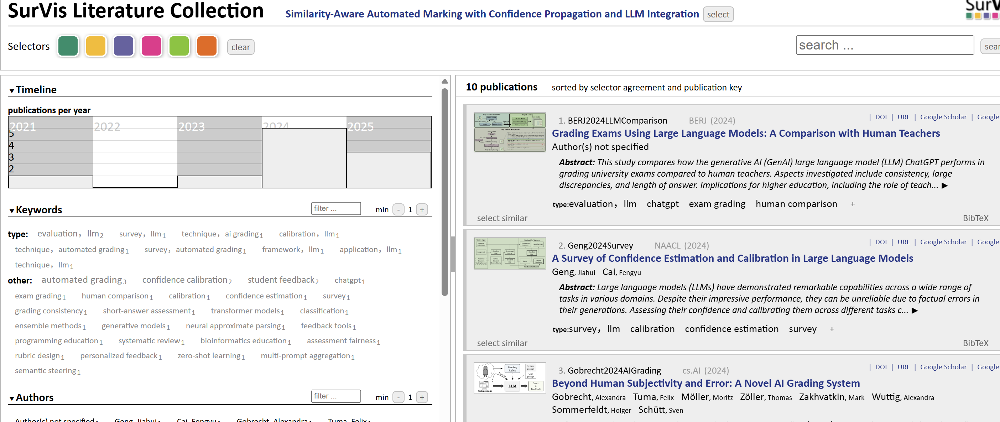

# SurVis - Visual Literature Browser

SurVis is a flexible online browser to present and analyze scientific literature. The system is made for authors of survey articles, theses, or books who want to share their references in a user-friendly way. All you need to start is a bib file and a list of keywords for your papers.

Review SurVis with a reference literature database: 
https://6820be4d32fbf102c25f3e2c--cool-eclair-636bd9.netlify.app/

---

## How To Use SurVis for Your Literature Collection

Download the latest SurVis release or fork this repository.

To start SurVis, open `src/index.html` in your browser.

The bibliography data is stored in `bib/references.bib` in BibTeX format.

Supplemental data is contained in `src/data/`:

- `tag_categories.js`: list of special tag categories. These can be used as prefixes for tags (e.g., `a:b` refers to tag `b` in category `a`)
- `authorized_tags.js`: tags that are defined with a description (highlighted in SurVis; description appears as a tooltip)
- `search_stopwords.js`: a list of stopwords used to exclude common terms from search queries
- `papers_pdf/` (optional): PDF files of the papers, using the BibTeX ID as filename
- `papers_img/` (optional): PNG thumbnails for the papers, also named using the BibTeX ID

⚠️ **Do not edit files in `src/data/generated/`**, as these are created automatically by the script.

After completing your changes, run `update_data.py` with Python 3. Reload the `index.html` in your browser to see the updated bibliography. The script will continuously monitor the `.bib` file for changes until stopped manually.

When edit mode is activated, BibTeX entries can be modified directly in the browser, but these changes will not be saved back to the `bib/` folder automatically. To persist them, use the "Download BibTeX" function in SurVis and manually paste the data into your `.bib` file. You can also use browser local storage to save/load data—however, these features are still experimental.

Other properties of SurVis (e.g., page title, editable mode) can be customized in `src/properties.js`. For publishing your literature collection, it's recommended to disable edit mode (`editable = false;`).

Enjoy using SurVis! Feel free to send feedback.

---

## Learn More

We published a paper about SurVis at IEEE VAST 2015 — please cite it if you use SurVis in your own publications:

Beck, Fabian; Koch, Sebastian; Weiskopf, Daniel:  
**Visual Analysis and Dissemination of Scientific Literature Collections with SurVis**.  
*IEEE Transactions on Visualization and Computer Graphics (2015)*  
- DOI: http://dx.doi.org/10.1109/TVCG.2015.2467757  
- Preview video: https://vimeo.com/136206061  

---

## Example Literature Collections Using SurVis

- Dynamic Graph Visualization – http://dynamicgraphs.fbeck.com
- Visualizing Group Structures in Graphs – http://go.visus.uni-stuttgart.de/groups-in-graphs/
- Performance Visualization – http://idav.ucdavis.edu/~ki/STAR/
- Visualization for Software Reuse – http://www.cos.ufrj.br/~schots/survis_reuse/
- Set Visualization – http://www.cvast.tuwien.ac.at/~alsallakh/SetViz/literature/www/index.html
- Visualizing High-Dimensional Data – http://www.sci.utah.edu/~shusenl/highDimSurvey/website/

Please contact us if you know of other SurVis-based projects.

---
**Fabian Beck**  
VISUS, University of Stuttgart  
✉️ fabian.beck@visus.uni-stuttgart.de  
🔗 http://research.fbeck.com

